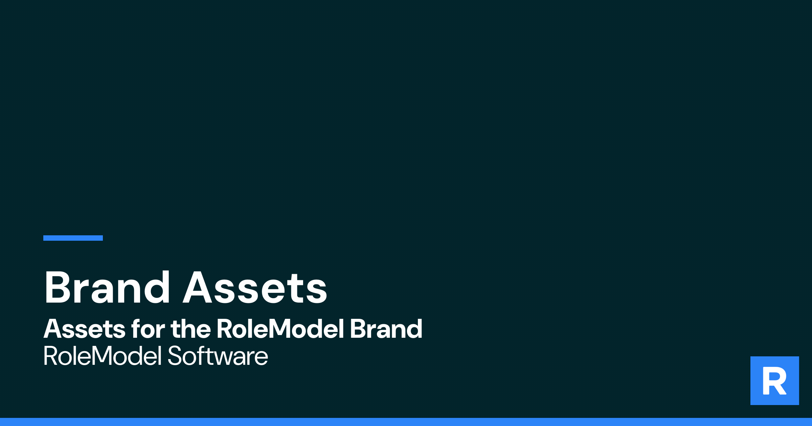

# RoleModel Brand



Canonical, versioned home for RoleModel Software's brand assets. This repo is the source of truth that feeds every distribution surface: the public brand page ([rolemodelsoftware.com/brand/rolemodel](https://rolemodelsoftware.com/brand/rolemodel)), design tools, documents, and AI agents.

The written brand context (voice, RoleModel Way references) lives in `standard/context/brand/`. This repo holds the _files and values_: logos, color, typography, icons, and machine-readable tokens.

## Why a repo

Rule and file should never separate. Brand changes here are pull requests: reviewable, versioned, and traceable. Downloads on the website should point at files we own (this repo), not third-party CDNs or Drive share links.

## Structure

```text
rolemodel-brand/
  README.md
  CHANGELOG.md          # what changed, Mastercard-style "recent updates"
  tokens/
    brand.json          # machine-readable source of truth (colors, type, spacing)
  logos/
    rolemodel/          # RMS logo suite: color/white SVG + @2x/@3x PNG, icon, R mark
    academy/            # Craftsmanship Academy logos + icon
    lightningcad/       # LightningCAD logos (black/white variants)
    designers/          # DPQ + Designer product marks (Dock, Deck, Railing, Flow, Building)
  css/                  # theme CSS (academy-theme.css)
  color/
    Colors.ase, RoleModelBrandColors.ase, ColorGridSmall@4x.png
  typography/
    DM_Sans/            # variable + static TTFs, OFL license
    Geist_Mono/         # variable + static TTFs, OFL license
  icons/
    black/              # curated icon set (290 SVGs)
    process-svg-colors.js
  graphics/
    highlighters/       # brand highlighter/underline vectors
    approach/           # approach graphic exports (SVG + @2x PNG)
  imagery/
    og/                 # OG / social images
    site/               # site imagery (core values, approach, milestones)
  dist/                 # generated bundles, e.g. rolemodel-brand-assets.zip
```

Design source files (.afdesign, .afphoto, .psd, .ai, print projects) stay in Drive; this repo versions exports only.

Note: the Drive folder spells it "LightingCAD" — normalized to `lightningcad` here.

`docs/` is a separate, self-contained static site (the brand guidelines portal, served via GitHub Pages) — its content workflow is documented below.

## Editing the brand guidelines site (`docs/`)

Copy (taglines, voice quotes, principle text) and structural config (grid spans, colors, font paths) both live under `docs/content/` — markdown for copy, JSON for structural "dials." A GitHub Actions workflow (`.github/workflows/build-content.yml`) regenerates `docs/assets/js/modules/{brand-data,page-data,site-content}.js` from `docs/content/**` automatically on every push to `main` and commits the result back — editing a file under `docs/content/` and pushing is enough; nothing needs to be run locally.

For local previewing before you push: `npm run content:build` (one-off) or `npm run content:watch` (rebuilds on save). `npm run content:test` runs the generator's own regression tests. See `docs/scripts/build-content.mjs` for the generator itself — it's the only thing that should ever write to `docs/assets/js/modules/{brand-data,page-data,site-content}.js`; those files are generated and get overwritten on the next build.

Note: `tokens/brand.json` (above) is a separate, legacy artifact from when the brand page was Framer-CMS-driven — nothing in `docs/` reads it.

## Consumers

- **Website brand page** — download links point at raw files here (or a CDN in front of this repo)
- **Developers** — tokens publishable as `@rolemodel/brand` alongside Optics
- **AI tools** — `tokens/brand.json` + this README give agents correct values without scraping the rendered page (raw HTML of the Framer page returns placeholder values to non-JS consumers)

## Contribution

- Asset additions and corrections: commit to `main`
- Changes to brand _values_ (colors, type scale, logo revisions): pull request + entry in `CHANGELOG.md`

## Status

- [x] Repo structure + tokens seeded from the live brand page
- [ ] Logos imported from Drive (currently served from Brandfetch CDN — replace)
- [ ] .ASE imported from Drive (currently a Drive share link on the site)
- [ ] Website download links repointed to self-hosted files
- [ ] Icon sets curated and exported
- [ ] `dist/` asset zip + "Download all" link on brand page
- [ ] Publish tokens as npm package (decide with Optics team)
